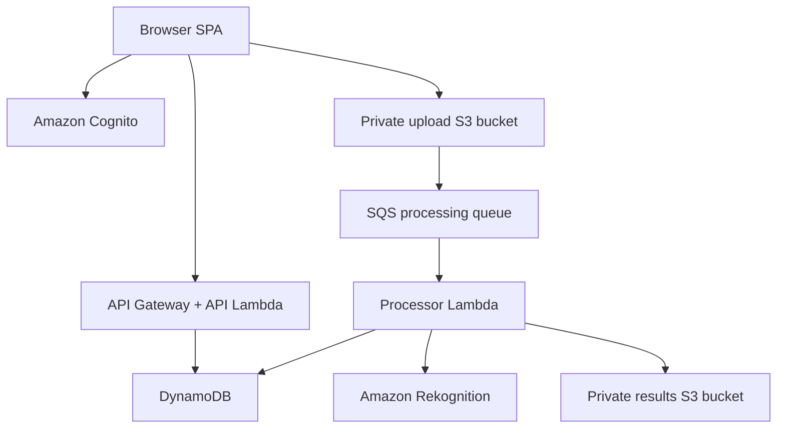
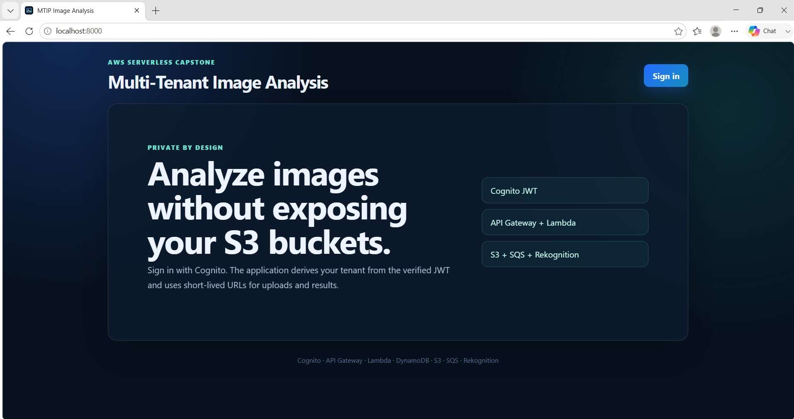
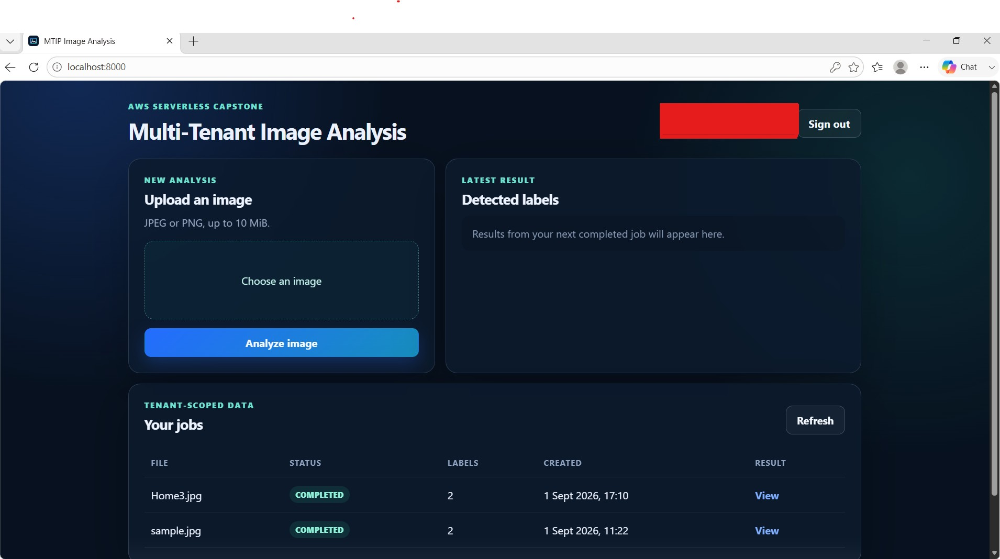

# Multi-Tenant Serverless Image Processing (MTIP)

AWS capstone project demonstrating Cognito authentication, server-derived
tenant authorization, presigned S3 transfers, asynchronous SQS/Lambda
processing, DynamoDB idempotency, Amazon Rekognition, failure isolation,
monitoring, and auditability.

## Verified outcome

The deployed Mumbai-region environment has completed the full browser workflow:
Cognito PKCE sign-in, JWT-protected job creation, direct private S3 upload,
S3-to-SQS delivery, idempotent Lambda processing, Rekognition label detection,
private result retrieval, and tenant-scoped job history.

## Architecture overview


## Application demo

The browser client authenticates through Amazon Cognito, uploads images directly to a private S3 bucket, tracks asynchronous processing, and displays tenant-scoped Amazon Rekognition results.

### Image upload and analysis Application



### Completed processing result



## Source layout

- `src/api/lambda_function.py` – tenant-aware HTTP API and presigned URLs.
- `src/processor/lambda_function.py` – SQS consumer, Rekognition analysis,
  deterministic results, processing leases, retries, and duplicate handling.
- `frontend/` – dependency-free Cognito PKCE browser client.
- `docs/architecture.md` – request flow, data model, and failure behavior.
- `docs/security.md` – identity, IAM, data, queue, and audit controls.
- `docs/test-evidence.md` – observed security and resilience results.
- `docs/operations-runbook.md` – alarms, log queries, and DLQ response.
- `docs/interview-guide.md` – concise explanation, tradeoffs, and limitations.

## Runtime configuration

The Lambda functions contain no account IDs, bucket names, passwords, tokens,
or other secrets. Resource names and processing parameters are injected through
Lambda environment variables during deployment.

## Lambda deployment packages

- `dist/mtip-api-lambda.zip`
- `dist/mtip-processor-lambda.zip`

Upload each archive directly to its matching Lambda function. Do not extract
the inner deployment archives before upload.

## Local frontend

The `frontend` directory is a dependency-free static SPA. It uses Cognito
Authorization Code + PKCE, keeps tokens in browser session storage, sends the
OAuth access token to API Gateway, uploads directly to S3, polls job state, and
renders the Rekognition result.

1. Open PowerShell in the extracted project and enter the directory:

   ```powershell
   cd frontend
   ```

2. Create the local configuration:

   ```powershell
   Copy-Item config.example.js config.js
   ```

3. Edit `config.js` and replace every placeholder. Use the Cognito domain,
   `mtip-web-client` app client ID, and HTTP API Invoke URL. These values are
   identifiers rather than passwords, but `config.js` is ignored by Git.

4. Start the local server:

   ```powershell
   python3 -m http.server 8000
   ```

5. Open `http://localhost:8000/` and sign in.

The Cognito callback and sign-out URLs and both S3 bucket CORS origins must be
exactly `http://localhost:8000/`. API Gateway CORS stores the same origin
without the trailing slash: `http://localhost:8000`.

Bucket names, account IDs, Cognito subjects, endpoints, and other
environment-specific identifiers are intentionally excluded from this bundle.
