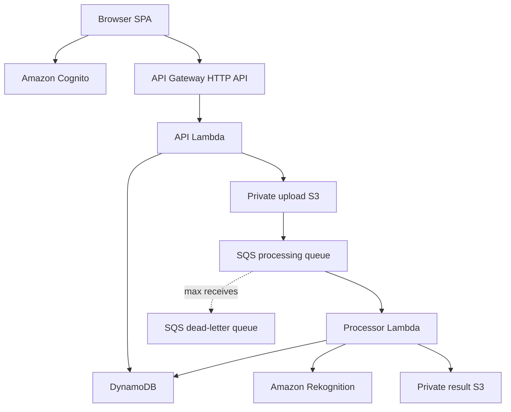

# Architecture

## System flow



## Request and processing sequence

1. The SPA signs a user in with Cognito Authorization Code + PKCE.
2. API Gateway validates the access token issuer, audience, expiry, signature,
   and `openid` scope.
3. The API Lambda resolves JWT `sub` through a DynamoDB membership item. The
   tenant ID is never accepted from the request body.
4. `POST /jobs` creates an `AWAITING_UPLOAD` job and returns a five-minute S3
   presigned `PUT` URL.
5. The browser uploads directly to the private upload bucket using the exact
   signed content type.
6. S3 sends `ObjectCreated` to SQS. The processor obtains an idempotent lease,
   validates the trusted key and object, and calls Rekognition DetectLabels.
7. The processor stores deterministic `labels.json` output and changes the job
   to `COMPLETED`.
8. `GET /jobs/{jobId}/result` returns a five-minute presigned `GET` URL only
   after tenant-scoped lookup and completed-state validation.

## DynamoDB access patterns

| Purpose | Partition key | Sort key |
| --- | --- | --- |
| Resolve a user membership | `USER#<cognito-sub>` | `MEMBERSHIP` |
| Read a tenant job | `TENANT#<tenant-id>` | `JOB#<job-id>` |
| List tenant jobs | `TENANT#<tenant-id>` | begins with `JOB#` |

There is no table scan in the runtime request path. Cross-tenant job IDs resolve
inside the caller's partition and therefore return `404` without disclosing the
existence of another tenant's record.

## S3 key layout

```text
tenants/<tenant-id>/uploads/<job-id>/image.jpg|png
tenants/<tenant-id>/results/<job-id>/labels.json
```

Tenant-scoped keys simplify validation, lifecycle management, investigation,
and future IAM segmentation.

## Failure and duplicate behavior

- Standard SQS accepts at-least-once delivery; duplicate events are expected.
- A completed job is skipped before S3 or Rekognition access.
- A conditional DynamoDB lease prevents concurrent processing of the same job.
- Failed records are returned through partial batch failure reporting.
- SQS retries a failed record up to three receives, then isolates it in the DLQ.
- Deterministic result keys prevent unbounded duplicate result objects.

